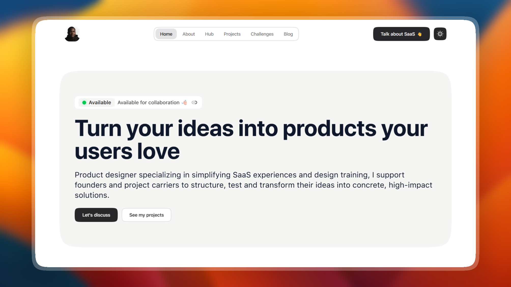
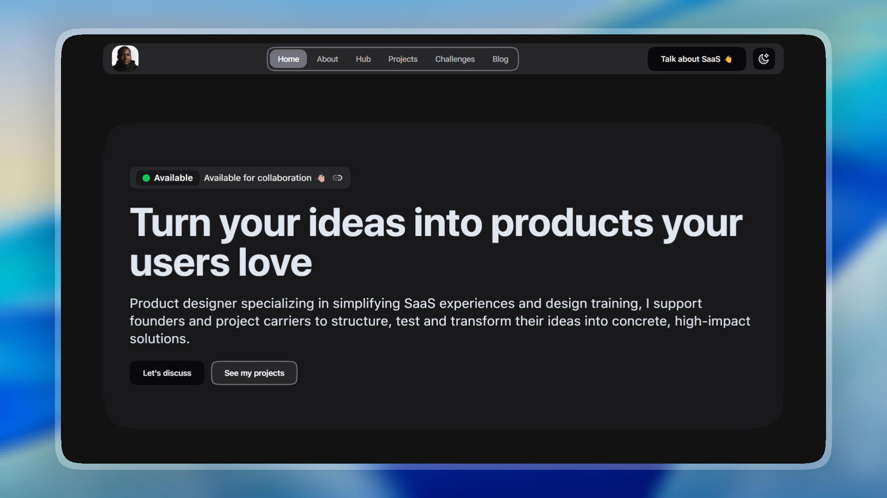

# Portfolio - Adriel Zimbril

> 🌟 **Aperçu visuel :** Consulte la [Galerie d'aperçus du Portfolio](preview/preview.FR.md) pour explorer l'interface.

|                 Mode Clair                  |                 Mode Sombre                 |
| :-----------------------------------------: | :-----------------------------------------: |
|  |    |

## 🚀 À propos

Portfolio professionnel d'**Adriel Zimbril**, développé avec **Next.js 16** et **Tailwind CSS 4**. Ce portfolio présente mes compétences, projets et expertise dans le développement web moderne, avec une attention particulière portée à l'expérience utilisateur et aux performances.

## 📖 Documentation

Pour des informations détaillées sur le projet, veuillez vous référer aux sections suivantes :

- **✨ [Fonctionnalités & Stack Technique](preview/features.FR.md)** : Explorez les fonctionnalités, la stack technologique et la structure du projet.
- **🚀 [Installation & Configuration](preview/setup.FR.md)** : Étapes d'installation, variables d'environnement et commandes de base de données.
- **🌍 [Internationalisation](preview/i18n.FR.md)** : Fonctionnement du système de traduction et ajout de nouvelles langues.
- **🗄️ [Base de Données & Supabase](preview/database.FR.md)** : Détails sur la structure de la base, les crons Supabase et les sauvegardes auto.
- **🛰️ [Guide de Déploiement](preview/deployment.FR.md)** : Comment déployer le projet sur Vercel et configurer les tâches planifiées.

## 🚀 Démarrage Rapide

```bash
# Installer les dépendances
pnpm install

# Configurer l'environnement
cp .env.example .env.local

# Lancer le serveur de développement
pnpm dev
```


- Les fichiers de traduction se trouvent dans `src/integrations/i18n/translations/`
- Langues supportées : `fr.json`, `en.json`, `zh-CN.json`
- Utilisez `useTranslations()` dans les composants client
- Utilisez `getTranslations()` dans les composants serveur

Pour ajouter une nouvelle clé de traduction :

1. Ajoutez la clé dans `fr.json` (source)
2. Traduisez dans `en.json` et `zh-CN.json`
3. Utilisez la clé dans votre composant

## 🌌 Rencontrons-nous dans l'espace (ou sur Terre) 🚀

Je suis toujours ravi de discuter de nouveaux projets, collaborations ou simplement échanger sur des idées créatives. Voici comment me contacter :

- **📧 Email**: [hello@adrielzimbril.com](mailto:hello@adrielzimbril.com)
- **🌐 Site**: [https://www.adrielzimbril.com](https://www.adrielzimbril.com)
- **🐦 Twitter**: [https://twitter.com/adrielzimbril](https://twitter.com/adrielzimbril)
- **💼 LinkedIn**: [https://www.linkedin.com/in/adrielzimbril](https://www.linkedin.com/in/adrielzimbril)
- **🐱‍💻 GitHub**: [https://github.com/adrielzimbril](https://github.com/adrielzimbril)

### 🐼 Fun Facts

- 🚀 Passionné par l'exploration spatiale et la technologie
- 🐼 Amoureux des pandas (et des animaux en général !)
- 🎨 Créatif dans l'âme, que ce soit en design ou en code
- ☕ Accro au café et aux défis techniques complexes


## 🌟 Rejoignez l'aventure

Si ce projet vous plaît, n'hésitez pas à :

- ⭐ Donner une étoile au projet
- 🐞 Signaler des bugs
- ✨ Proposer des améliorations
- 🚀 Partager avec d'autres passionnés

## 💖 Soutenir le projet

Si vous trouvez ce projet utile et souhaitez soutenir son développement, vous pouvez le faire via ces plateformes :

[](https://go.adrielzimbril.com/bmc)
[](https://go.adrielzimbril.com/kfi)
<!-- [](https://go.adrielzimbril.com/plr) -->
[](https://go.adrielzimbril.com/gs)

## 🌐 Hébergement

Ce projet est hébergé à 100% sur une infrastructure cloud moderne pour une performance et une fiabilité maximales :

[](https://vercel.com)
[](https://supabase.com)

## 📄 Licence

Ce projet est sous licence MIT. N'hésitez pas à l'utiliser comme base pour votre propre portfolio ou projet.

---

**Développé avec ❤️ par Adriel Zimbril**  
_Product Designer & Développeur Fullstack_  
🚀 Explorateur de l'univers numérique | 🐼 Ami des pandas | 🎨 Créateur passionné
